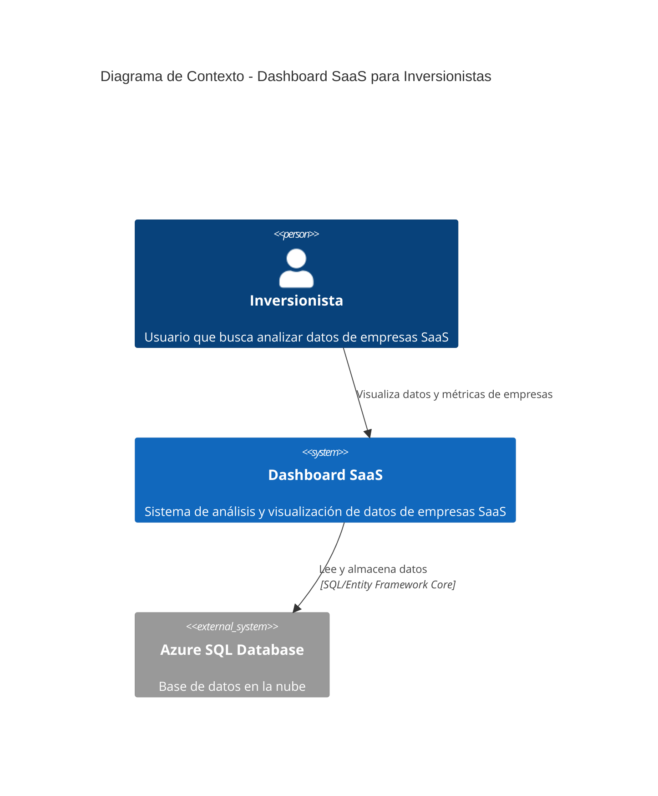
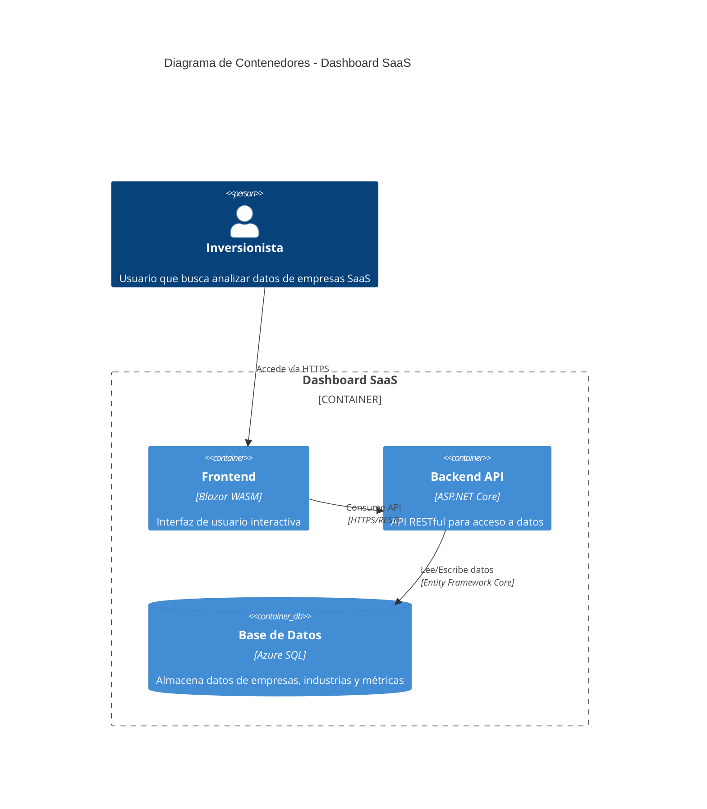

# Diagramas de Arquitectura C4

## Diagrama de Contexto

```mermaid
C4Context
title Diagrama de Contexto - Dashboard SaaS para Inversionistas

Person(investor, "Inversionista", "Usuario que busca analizar datos de empresas SaaS")
System(dashboard, "Dashboard SaaS", "Sistema de análisis y visualización de datos de empresas SaaS")
System_Ext(azureSQL, "Azure SQL Database", "Base de datos en la nube")

Rel(investor, dashboard, "Visualiza datos y métricas de empresas")
Rel(dashboard, azureSQL, "Lee y almacena datos", "SQL/Entity Framework Core")
```

## Diagrama de Contenedores

```mermaid
C4Container
title Diagrama de Contenedores - Dashboard SaaS

Person(investor, "Inversionista", "Usuario que busca analizar datos de empresas SaaS")

Container_Boundary(c1, "Dashboard SaaS") {
    Container(frontend, "Frontend", "Blazor WASM", "Interfaz de usuario interactiva")
    Container(backend, "Backend API", "ASP.NET Core", "API RESTful para acceso a datos")
    ContainerDb(db, "Base de Datos", "Azure SQL", "Almacena datos de empresas, industrias y métricas")
}

Rel(investor, frontend, "Accede vía HTTPS")
Rel(frontend, backend, "Consume API", "HTTPS/REST")
Rel(backend, db, "Lee/Escribe datos", "Entity Framework Core")
```