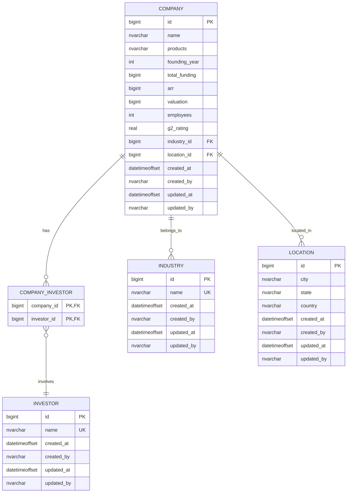

# Modelo de Base de Datos

## Diagrama Entidad-Relación

## Descripción del Modelo

### Entidades Principales

1. **Company (Empresa)**
   - Entidad central que almacena información de empresas SaaS
   - Contiene métricas importantes como ARR, valoración, empleados
   - Referencias a ubicación e industria
   - Campos de auditoría (created_at, updated_at)

2. **Industry (Industria)**
   - Catálogo de industrias
   - Nombre único para evitar duplicados
   - Campos de auditoría

3. **Location (Ubicación)**
   - Normalización de ubicaciones geográficas
   - Estructura jerárquica: ciudad, estado, país
   - Campos de auditoría

4. **Investor (Inversor)**
   - Catálogo de inversores
   - Nombre único para evitar duplicados
   - Campos de auditoría

### Relaciones

1. **Company_Investor**
   - Relación muchos a muchos entre Company e Investor
   - Permite rastrear inversores por empresa

### Características del Diseño

1. **Integridad Referencial**
   - Claves foráneas con referencias apropiadas
   - Eliminación en cascada para company_investor

2. **Auditoría**
   - Todas las tablas incluyen created_at/updated_at
   - Tracking de usuarios que realizan cambios

3. **Tipos de Datos**
   - BIGINT para IDs y valores monetarios grandes
   - NVARCHAR para texto con soporte Unicode
   - REAL para ratings con decimales
   - INT para años y conteos
   - DATETIMEOFFSET para timestamps con zona horaria